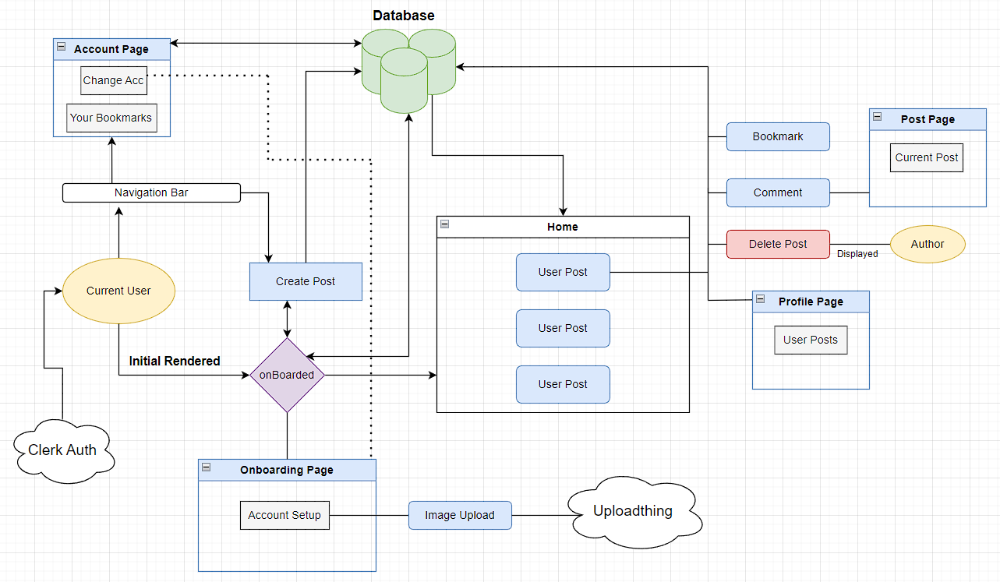

# CRUD Operations

## Getting Started

To run this project locally for development purposes, follow the steps below:

### Prerequisites

1. **Clerk Account**: Create a [Clerk](https://clerk.com/) account and set up a project to obtain the `PUBLISHABLE_KEY` and `SECRET_KEY`.
2. **MongoDB Account**: Sign up for [MongoDB](https://account.mongodb.com/account/login?signedOut=true) and create a database. Obtain your `MONGODB_URL` for database connection.
3. **Uploadthing Account**: Create an [Uploadthing](https://uploadthing.com/) account for handling profile image uploads. Retrieve your `SECRET_KEY` and `APP_ID`.
4. **Create `.env.local` File**: In the root directory of this project, create a `.env.local` file.
5. **Add Environment Variables**: Add the following environment variables to the `.env.local` file:

```env
# .env.local

NEXT_PUBLIC_CLERK_PUBLISHABLE_KEY=
CLERK_SECRET_KEY=

MONGODB_URL=

UPLOADTHING_SECRET=
UPLOADTHING_APP_ID=

```

## The flow of this project


